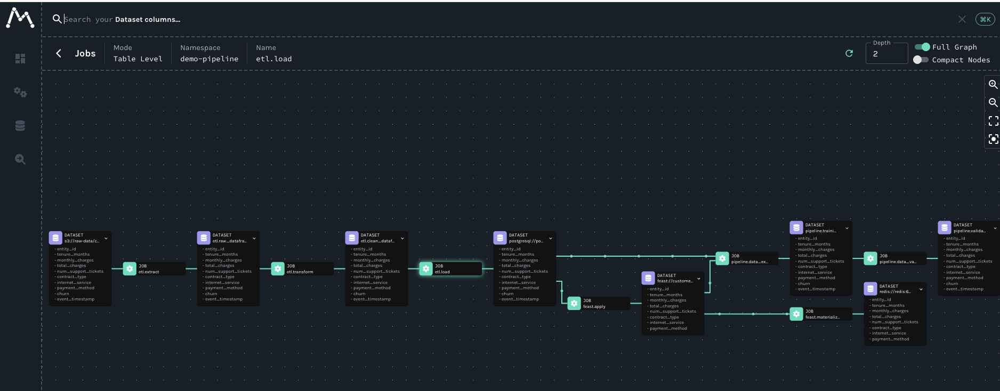

# OpenLineage POC

An end-to-end proof-of-concept for data lineage tracking across an ML pipeline using [OpenLineage](https://openlineage.io/), [Marquez](https://marquezproject.ai/), and [Feast](https://feast.dev/).

## What's in this repo

This repo ties together three upstream projects via git submodules:

| Directory | Upstream Repo | Role |
|-----------|--------------|------|
| `OpenLineage/` | [OpenLineage/OpenLineage](https://github.com/OpenLineage/OpenLineage) | The lineage standard, Python/Java clients, Spark/Airflow/dbt integrations |
| `marquez/` | [MarquezProject/marquez](https://github.com/MarquezProject/marquez) | Lineage backend: REST API, PostgreSQL storage, web UI |
| `lineage-demo-pipeline/` | [rh-waterford-et/lineage-demo-pipeline](https://github.com/rh-waterford-et/lineage-demo-pipeline) | Customer churn prediction pipeline with OL tracking |

Plus original content:

| Directory | Contents |
|-----------|----------|
| `docs/` | Explanation docs covering each project and how they connect |
| `patches/` | Local fixes needed to run lineage-demo-pipeline on macOS |

## The demo pipeline

The lineage-demo-pipeline implements a customer churn prediction workflow:

```
MinIO (raw CSV)
  → ETL (extract, transform, load)
    → PostgreSQL (data warehouse)
      → Feast (feature store: offline in PG, online in Redis)
        → Data preparation (extraction, validation, feature engineering)
          → XGBoost training → MLflow (experiment tracking + model registry)
            → FastAPI inference (online predictions)
```

### Role of Feast

[Feast](https://feast.dev/) is the feature store that sits between the data warehouse and ML training/serving:

- **Feature definitions** -- Declares a `customer` entity and a `customer_features_view` with 7 features (tenure, charges, contract type, etc.) in `src/feature_store/definitions.py`
- **Offline store (PostgreSQL)** -- Feast reads from the `customer_features` table for historical feature retrieval. During training, `get_historical_features()` performs a point-in-time join to prevent data leakage
- **Online store (Redis)** -- `feast materialize` pushes the latest feature values from PostgreSQL to Redis for low-latency serving
- **Serving** -- The inference API fetches features from Redis via Feast's online API, ensuring training and serving use the same feature definitions

Feast also has built-in OpenLineage support -- it can emit lineage events during `apply` and `materialize` operations, connecting the feature store to the broader lineage graph.

### Role of OpenLineage and Marquez

Each pipeline stage emits [OpenLineage](https://openlineage.io/) events describing its inputs, outputs, and metadata. These events are sent to [Marquez](https://marquezproject.ai/), which stores them and provides a web UI to visualize the full lineage graph -- showing how data flows from raw CSV through feature engineering, training, and into production inference.

## Quick start

### 1. Clone with submodules

```bash
git clone --recurse-submodules https://github.com/abiazett/openLineagePOC.git
cd openLineagePOC
```

### 2. Apply local fixes

```bash
cd lineage-demo-pipeline
git apply ../patches/local-fixes.patch
```

### 3. Start infrastructure

```bash
./scripts/start_services.sh
```

This brings up all services: MinIO, PostgreSQL, Redis, MLflow, the inference API, and the Marquez lineage backend (API + web UI + database).

### 4. Set environment variables

```bash
export MINIO_SECRET_KEY=minioadmin
export MLFLOW_TRACKING_URI=http://localhost:5050
export AWS_ACCESS_KEY_ID=minioadmin
export AWS_SECRET_ACCESS_KEY=minioadmin
export MLFLOW_S3_ENDPOINT_URL=http://localhost:9000
export OPENLINEAGE_URL=http://localhost:5002
export OPENLINEAGE_NAMESPACE=demo-pipeline
```

### 5. Run the pipeline

```bash
# Create a venv and install deps
python3.11 -m venv .venv
source .venv/bin/activate
pip install -r requirements.txt
pip install -e "../openlineage-oai[mlflow]"  # Custom OL adapters

# Generate synthetic data (if not present)
python data/generate_dataset.py

# Run all stages
./scripts/run_all.sh
```

With `OPENLINEAGE_URL` set, each stage emits real OpenLineage events to Marquez as it executes.

### 6. Test inference

```bash
curl -X POST http://localhost:8080/predict \
  -H 'Content-Type: application/json' \
  -d '{"entity_ids": [1, 2, 3]}'
```

### 7. View lineage

Open http://localhost:3000 to see the lineage graph in Marquez. Click any job to see its inputs, outputs, schema facets, and run history. Enable **Full Graph** in the top-right to see the complete end-to-end flow.



### 8. Access UIs

| Service | URL | Credentials |
|---------|-----|-------------|
| Marquez Web (lineage graph) | http://localhost:3000 | (none) |
| Marquez API | http://localhost:5002 | (none) |
| MLflow (experiment tracking) | http://localhost:5050 | (none) |
| MinIO Console (object storage) | http://localhost:9001 | minioadmin / minioadmin |
| Inference API (Swagger) | http://localhost:8080/docs | (none) |

## Architecture

```
┌─────────────────────────────────────────────────────────────────────┐
│                    Docker Compose Services                          │
│                                                                     │
│  MinIO (:9000)        PostgreSQL (:5432)         Redis (:6379)     │
│  Object storage       Data warehouse +           Feast online      │
│  (raw CSV)            Feast offline store        store              │
│                                                                     │
│  MLflow (:5050)       Inference API (:8080)                        │
│  Experiment tracking  FastAPI + Feast + MLflow                     │
│  + model registry     online predictions                           │
│                                                                     │
│  Marquez API (:5002)  Marquez Web (:3000)  Marquez DB (:5433)     │
│  OL event ingestion   Lineage graph UI     Lineage metadata       │
└─────────────────────────────────────────────────────────────────────┘

Pipeline flow (local execution):

  1. ETL        extract CSV from MinIO → transform → load to PostgreSQL
  2. Feast      register feature views (apply) → materialize to Redis
  3. Pipeline   extract training data via Feast point-in-time join
                → validate → engineer features
                → train XGBoost → log to MLflow → register model
  4. Serving    load champion model from MLflow + features from Redis
                → predict churn probability
```

## What the patch fixes

The `patches/local-fixes.patch` addresses these issues when running locally on macOS:

1. **MLflow port conflict** -- macOS AirPlay uses port 5000; remapped to 5050
2. **MLflow DNS rebinding** -- MLflow 3.10+ rejects non-localhost Host headers; adds `--allowed-hosts`
3. **Feast Docker networking** -- `feature_store.yaml` uses `localhost` which doesn't resolve inside containers; sed patches hostnames at startup
4. **Marquez services** -- Adds marquez-db, marquez-api, and marquez-web to docker-compose for lineage visualization
5. **OpenLineage emission** -- Wires `run_etl.py` and `run_pipeline.py` to emit real OL events when `OPENLINEAGE_URL` is set

## Documentation

See `docs/` for detailed explanations:

- [01 - OpenLineage Explained](docs/01-openlineage-explained.md) -- The lineage standard
- [02 - Marquez Explained](docs/02-marquez-explained.md) -- The lineage backend
- [03 - Lineage Demo Pipeline Explained](docs/03-lineage-demo-pipeline-explained.md) -- The POC pipeline
- [04 - How They Connect](docs/04-how-they-connect.md) -- How all three fit together
